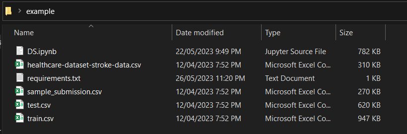
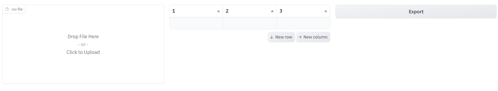
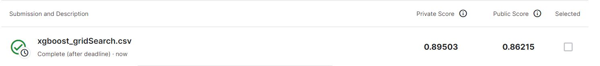

# Data Science Project :) 🥇

Our aim in this project was to undergo the lifecycle of data science on a combination of two datasets that were provided to us <br /> 
NoteBook created by <br /> 
🌟 Yaser Shoshaa <br />
🌟 Firas Elbayoumi <br /> 
🌟 Briksam Kasımoğlu <br /> 


## Table of Contents 🗺️
- [Requirements](#requirements)
- [Data](#data)
- [Setup](#setup)
- [Reproducing results](#reproducing-results)
- [Results](#results)

## Requirements 📋 <a name="requirements"></a>

- Python 3.8.8
- Pandas-1.2.4
- Scikit-learn 1.2.2
- Numpy 1.20.1
- Matplotlib 3.3.4
- Seaborn 0.11.1
- missingno 0.5.2
- feature-engine 1.6.0
- xgboost 1.7.5

```
pip install -r requirements.txt
```

## Data ℹ️ <a name="data"></a>

The datasets used in this project can be obtained from <br />
 • [Real-world data: The Stroke Prediction Dataset](https://www.kaggle.com/datasets/fedesoriano/stroke-prediction-dataset)  <br />
 • [Synthetic data: The Synthetic Stroke Prediction Dataset](https://www.kaggle.com/competitions/playground-series-s3e2/data)


## Setup ⚙️ <a name="setup"></a>

Download the notebook + the datasets from the provided links after that put everything in the same directory to avoid any problems lastly install the required python libraries



if your setup looks like this you are good to go 👍

## Reproducing Results 🔁 <a name="reproducing-results"></a>

We have deployed our Logistic Regression With under Sampling Model into the huggingface platform <br /> 

Model Link https://huggingface.co/spaces/FerasOo/stroke_prediction <br /> 

Inorder to recreate the same results as we did, just upload the test.csv file in csv file section in the left 



Wait for a bit of time and if the browser become unresponsive press wait <br /> 


When it is done you can export the file by pressing Export on the right of the screen and download the results file <br /> 

Finally upload the file in the kaggle website provided below and see the result <br /> 

[Submission](https://www.kaggle.com/competitions/playground-series-s3e2/submissions)

## Results 📊 <a name="results"></a>

**Kaggle Score 🎯**
<br /> 
<br /> 
Logistic Regression With under Sampling


**AUROC 📈**


**Evaluation Metrics 📌**


Alternative Method XGBoost With Grid Search ↔️


